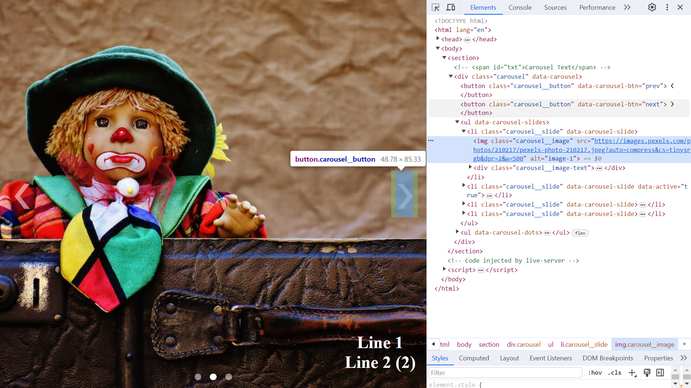

# :zap: HTML SCSS Carousel

* HTML, CSS and vanilla JS used to create a carousel of images.
* **Note:** to open web links in a new window use: _ctrl+click on link_


## :page_facing_up: Table of contents

* [:zap: HTML SCSS Carousel](#zap-html-scss-carousel)
  * [:page\_facing\_up: Table of contents](#page_facing_up-table-of-contents)
  * [:books: General info](#books-general-info)
  * [:camera: Screenshots](#camera-screenshots)
  * [:signal\_strength: Technologies](#signal_strength-technologies)
  * [:floppy\_disk: Setup](#floppy_disk-setup)
  * [:computer: Code Examples](#computer-code-examples)
  * [:cool: Features](#cool-features)
  * [:clipboard: Status \& To-Do List](#clipboard-status--to-do-list)
  * [:clap: Inspiration](#clap-inspiration)
  * [:file\_folder: License](#file_folder-license)
  * [:envelope: Contact](#envelope-contact)

## :books: General info

* SCSS used to make styles code better structured and easier to follow.
* User can click on forward or back buttons to change image on screen, otherwise images will scroll automatically every 4.5 seconds (adjustable)

## :camera: Screenshots

.

## :signal_strength: Technologies

* [HyperText Markup Language HTML](https://developer.mozilla.org/en-US/docs/Glossary/HTML)
* [ECMAScript 2023 Javascript](https://developer.mozilla.org/en-US/docs/Web/JavaScript)
* [SCSS](https://sass-lang.com/) CSS preprocessing
* [Cascading Style Sheets CSS](https://developer.mozilla.org/en-US/docs/Web/CSS) styling

## :floppy_disk: Setup

* I used the [Visual Studio Live SASS Compiler](https://marketplace.visualstudio.com/items?itemName=glenn2223.live-sass) for live compilation of SCSS into the CSS used in the project.
* Open index.html using [Visual Studio Live Server](https://marketplace.visualstudio.com/items?itemName=ritwickdey.LiveServer). Changes are updated automatically on server.

## :computer: Code Examples

* `js/script.js` extract to listen for user click on forward or back carousel buttons. A value of 1 or -1 is then passed to the moveSlide function that will move the carousel and highlight the next/previous dot on screen.

```javascript
buttons.forEach((button) => {
  button.addEventListener("click", () => {
    const offset = button.dataset.carouselBtn === "next" ? 1 : -1;
    moveSlide(offset);
  });
});
```

## :cool: Features

* Vanilla javascript used, so no Bootstrap JS download required that slows down initial render speed.

## :clipboard: Status & To-Do List

* Status: Working.
* To-Do: Use BEM CSS formatting, use images from CDN that are auto-scaled and compressed, bottom right text to be a box with title, para text and a call-to-action button.

## :clap: Inspiration

* [SASS Mixins](https://sass-lang.com/guide/#mixins)

## :file_folder: License

* This project is licensed under the MIT License - see the LICENSE file for details.

## :envelope: Contact

* Repo created by [ABateman](https://github.com/AndrewJBateman), email: `gomezbateman@yahoo.com`
